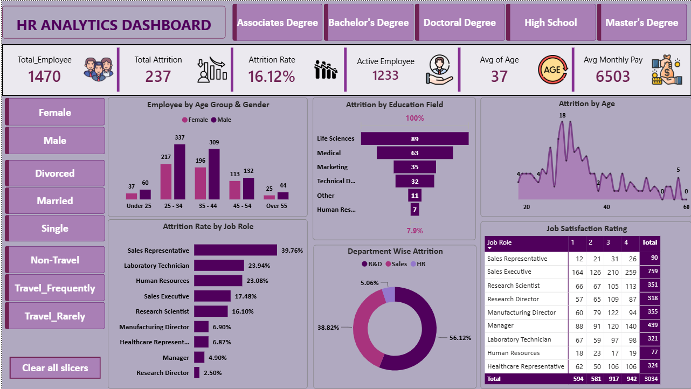

# 📊 HR Analytics Dashboard (Power BI)

## Project Overview

This HR Analytics Dashboard was developed using Microsoft Power BI to analyze employee data and identify workforce trends. The dashboard helps HR teams monitor employee attrition, demographics, job satisfaction, salary, and education insights for better decision-making.

---

## Tools Used

- Microsoft Power BI
- Microsoft Excel
- Power Query
- DAX

---

## Dashboard Features
### KPI Cards

- Total Employees
- Active Employees
- Total Attrition
- Attrition Rate
- Average Age
- Average Monthly Salary

---

### Interactive Filters

- Education Level
- Gender
- Marital Status
- Business Travel

---

### Visualizations

- Employee by Age Group & Gender
- Attrition by Education Field
- Attrition by Age
- Attrition Rate by Job Role
- Department-wise Attrition
- Job Satisfaction Rating

---

## Key Insights

- The organization has **1,470 employees**, out of which **237 employees have left**, resulting in an **attrition rate of 16.12%**.

- The average employee age is **37 years**, indicating a predominantly mid-career workforce.

- Employees with **Life Sciences** education recorded the highest number of attrition cases compared to other education fields.

- **Sales Representatives** experienced the highest attrition rate (39.76%), followed by Laboratory Technicians and Human Resources.

- The **Research & Development (R&D)** department contributed the highest share of employee attrition (56.12%), followed by Sales.

- Employees aged **25–34 years** represent the largest workforce segment and also show comparatively higher attrition.

- Job satisfaction varies across different job roles, highlighting opportunities to improve employee engagement and retention.

---

## Skills Demonstrated

- Data Cleaning
- Power Query
- DAX Measures
- KPI Design
- Interactive Slicers
- Dashboard Design
- Business Insights

---

## Project Preview

---

## Author

### Prachi Vaishkiyar
